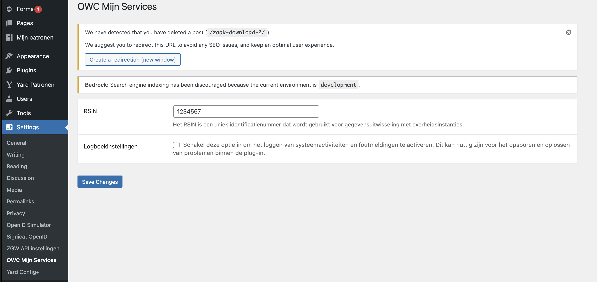

# OWC Mijn Services

OWC Mijn Services is a WordPress plugin built around custom Gutenberg blocks that integrate with ZGW (Zaakgericht Werken) APIs.
These blocks are the foundation of the plugin, allowing you to easily configure, and display data—directly within the WordPress block editor.

## Installation

### Manual installation

1. Upload the 'owc-mijn-services' folder in to the `/wp-content/plugins/` directory.
2. `cd /wp-content/plugins/owc-mijn-services`
3. Run composer install, NPM asset build is in version control already.
4. Activate the plugin in via the WordPress admin.

### Composer installation

1. `composer source git@github.com:OpenWebconcept/plugin-owc-mijn-services.git`
2. `composer require plugin/owc-mijn-services`
3. `cd /wp-content/plugins/owc-mijn-services`
4. Run `composer install`, NPM asset build is in version control already.

### Configure your project

To use this plugin, make sure the following pages exist in your WordPress installation:

- A single page for a Zaak that contains the owc-my-services/zaak block.
- A single page for a Zaak download, no blocks required.
- A page (any type) that contains the owc-my-services/mijn-zaken block.

## Gutenberg blocks

### owc-my-services/zaak

This block displays all data for a single Zaak.
Selecting a ZGW API supplier is the only configuration required in the block settings.

### owc-my-services/mijn-zaken

This block displays an overview of all Zaken, filtered by the selected supplier and the social security number (BSN) of the currently logged-in citizen.

#### Logging

Enable logging to keep track of errors during communication with the ZGW supplier(s).

- Logs are written daily to `owc-my-services-log{-date}.json` in the plugin root directory.
- A rotating file handler keeps up to 7 log files by default, deleting the oldest as needed.
- You can change the maximum number of log files using the filter described below.



## Hooks

### Customizing Template Paths

You can customize the template paths by using the following filter in your theme or another plugin:

```php
add_filter('owcms::view/template-paths', function ($paths) {
    $paths[] = get_stylesheet_directory() . '/resources/views/owc-mijn-services';

    return $paths;
});
```

To prioritize your custom template path over the default ones, use this example:

```php
add_filter('owcms::view/template-paths', function ($paths) {
    $paths[] = get_stylesheet_directory() . '/resources/views/owc-mijn-services';

    return array_reverse($paths);
});
```

### Change the maximum number of log files

Use the following filter to alter the rotating file handler's max files setting:

```php
apply_filters('owcms::logger/rotating_filer_handler_max_files', OWC_MY_SERVICES_LOGGER_DEFAULT_MAX_FILES)
```

### Intercept exceptions for custom handling

You can intercept exceptions caught by the plugin for additional processing or custom logging using this filter:

```php
add_action('owcms::exception/intercept', $exception, $method)
```

The `$exception` parameter contains the caught exception object
