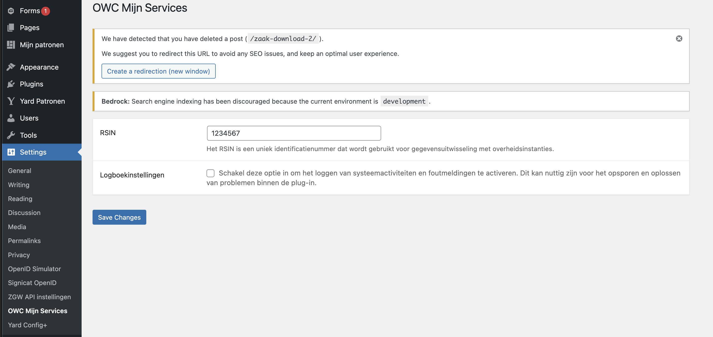

# OWC Mijn Services

OWC Mijn Services is a WordPress plugin built around custom Gutenberg blocks that integrate with ZGW (Zaakgericht Werken) APIs.
These blocks are the foundation of the plugin, allowing you to easily configure, and display data—directly within the WordPress block editor.

## Installation

### Manual installation

1. Upload the 'owc-mijn-services' folder in to the `/wp-content/plugins/` directory.
2. `cd /wp-content/plugins/owc-mijn-services`
3. Run composer install, NPM asset build is in version control already.
4. Activate the plugin in via the WordPress admin.

### Composer installation

1. `composer source git@github.com:OpenWebconcept/plugin-owc-mijn-services.git`
2. `composer require plugin/owc-mijn-services`
3. `cd /wp-content/plugins/owc-mijn-services`
4. Run `composer install`, NPM asset build is in version control already.

### Configure your project

To use this plugin, make sure the following pages exist in your WordPress installation:

- A single page for a Zaak that contains the owc-my-services/zaak block.
- A single page for a Zaak download, no blocks required.
- A page (any type) that contains the owc-my-services/mijn-zaken block.

## Gutenberg blocks

### owc-my-services/zaak

This block displays all data for a single Zaak.
Selecting a ZGW API supplier is the only configuration required in the block settings.

### owc-my-services/mijn-zaken

This block displays an overview of all Zaken, filtered by the selected supplier and the social security number (BSN) of the currently logged-in citizen.

### NLDS Components

Both `owc-my-services/zaak` and `owc-my-services/mijn-zaken` blocks use components from the **NLDS (Nederlandse Design System)**.  

- The NLDS React components and CSS are automatically loaded when a block is placed on the page.  
- The project should have NLDS design tokens available to ensure styling.  

## Settings

All settings are available under **Settings > OWC Mijn Services** in the WordPress admin. By
default, only administrators can see or edit them.

- **Logboekinstellingen** — Enables logging of system activity and error messages, useful for
  troubleshooting. See [Logging](#logging) below for where the log files end up.
- **DOC- en DOCX-documenten uitsluiten** — Excludes `.doc` and `.docx` documents when fetching a
  zaak's documents.
- **Toegestane informatieobjecttypen** — Restricts which informatieobjecttypen may be used when
  fetching or downloading a zaak's documents. Leave the field empty to allow all types. See
  [Toegestane informatieobjecttypen](#toegestane-informatieobjecttypen) below.
- **Productiecontroles uitschakelen** — Disables the requirement to configure at least one of the
  "Filter op BSN" or "Filter op KVK" block attributes. Production checks are enabled by default.
- **Filtering op KVK uitschakelen** — Disables filtering by KVK number, for suppliers that don't
  support it. Users logged in via eHerkenning won't be able to retrieve zaken while this is off, if
  the block relies on KVK filtering.
- **Uitgebreide KVK-filtering inschakelen** — Additionally filters by RSIN or vestigingsnummer when
  filtering by KVK, if available. Not every supplier supports these extra filter parameters.

### Toegestane informatieobjecttypen

This field is a repeatable dropdown, grouped per configured ZGW supplier, listing that supplier's
informatieobjecttypen. Selected values are matched against the `informatieobjecttype` URL of a
zaak's documents.

- The list is fetched from each supplier's `informatieobjecttypen` endpoint and cached for 24
  hours, so opening the settings page doesn't have to wait on the ZGW API.
- A WP-Cron job runs daily at 04:00 to refresh the cache before anyone needs it.
- Use the **Informatieobjecttypen opnieuw ophalen** button below the field to clear the cache
  manually, forcing a fresh fetch on next use.
- See [Grant access to the "Toegestane informatieobjecttypen" setting for other roles](#grant-access-to-the-toegestane-informatieobjecttypen-setting-for-other-roles)
  to expose this one field to users without the `manage_options` capability.

## Logging

Enable logging to keep track of errors during communication with the ZGW supplier(s).

- Logs are written daily to `owc-my-services-log{-date}.json` in the WordPress webroot directory.
- A rotating file handler keeps up to 7 log files by default, deleting the oldest as needed.
- You can change the maximum number of log files using the filter described below.



## Hooks

### Customizing Template Paths

You can customize the template paths by using the following filter in your theme or another plugin:

```php
add_filter('owcms::view/template-paths', function ($paths) {
    $paths[] = get_stylesheet_directory() . '/resources/views/owc-mijn-services';

    return $paths;
});
```

To prioritize your custom template path over the default ones, use this example:

```php
add_filter('owcms::view/template-paths', function ($paths) {
    $paths[] = get_stylesheet_directory() . '/resources/views/owc-mijn-services';

    return array_reverse($paths);
});
```

### Change the maximum number of log files

Use the following filter to alter the rotating file handler's max files setting:

```php
apply_filters('owcms::logger/rotating_filer_handler_max_files', OWC_MY_SERVICES_LOGGER_DEFAULT_MAX_FILES)
```

### Intercept exceptions for custom handling

Intercept exceptions caught by the plugin for additional processing or custom logging using this action:

```php
do_action('owcms::exception/intercept', $exception, $method)
```

The `$exception` parameter contains the caught exception object

### Restricting page access based on authentication requirements

Pages can be protected by enforcing specific authentication methods, such as **DigiD** and/or **eHerkenning**.
These access rules are configured through the **Security** metabox in the page editor.

By default, only the `page` post type supports access restrictions.
This can be customized using the following filter:

```php
apply_filters( 'owcms::gatekeeper/metabox_post_types', array( 'page' ) )
```

### Configure number of redirection posts as option

Defaults to fetching all posts for the configured post types.
Increase or limit this value when the query becomes too heavy by applying the filter below:

```php
apply_filters( 'owcms::gatekeeper/metabox_number_of_redirect_options', -1 )
```

### Grant access to the "Toegestane informatieobjecttypen" setting for other roles

The "Toegestane informatieobjecttypen" setting (Settings > OWC Mijn Services) restricts which
`informatieobjecttype` URLs are allowed when fetching and downloading a zaak's documents. By
default, only administrators can see or edit this setting.

Use this filter to grant access to users with a different capability instead:

```php
apply_filters( 'owcms::settings/allowed_informatieobjecttypen_capability', 'manage_options' )
```

When filtered to a capability other than `manage_options`, any user holding that capability can
open the settings page, but will see only this one field — every other setting on the page
remains restricted to administrators. Filtering the capability doesn't grant it to anyone; the
target role still needs to actually hold it, for example:

```php
add_filter('owcms::settings/allowed_informatieobjecttypen_capability', function () {
    return 'manage_informatieobjecttypen';
});

add_action('init', function () {
    $role = get_role('editor');

    if ($role && ! $role->has_cap('manage_informatieobjecttypen')) {
        $role->add_cap('manage_informatieobjecttypen');
    }
});
```
